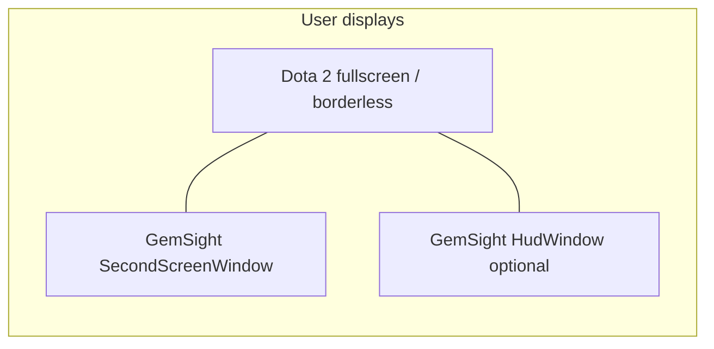
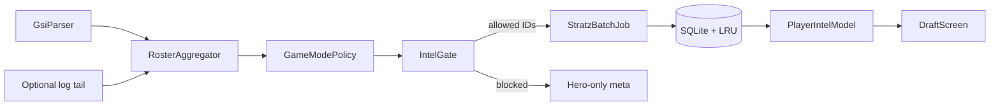
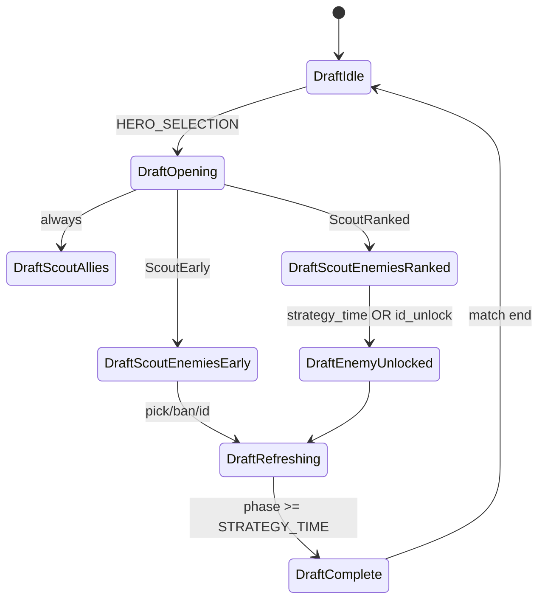
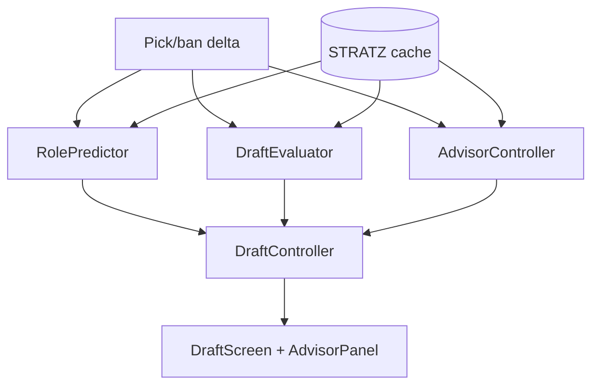
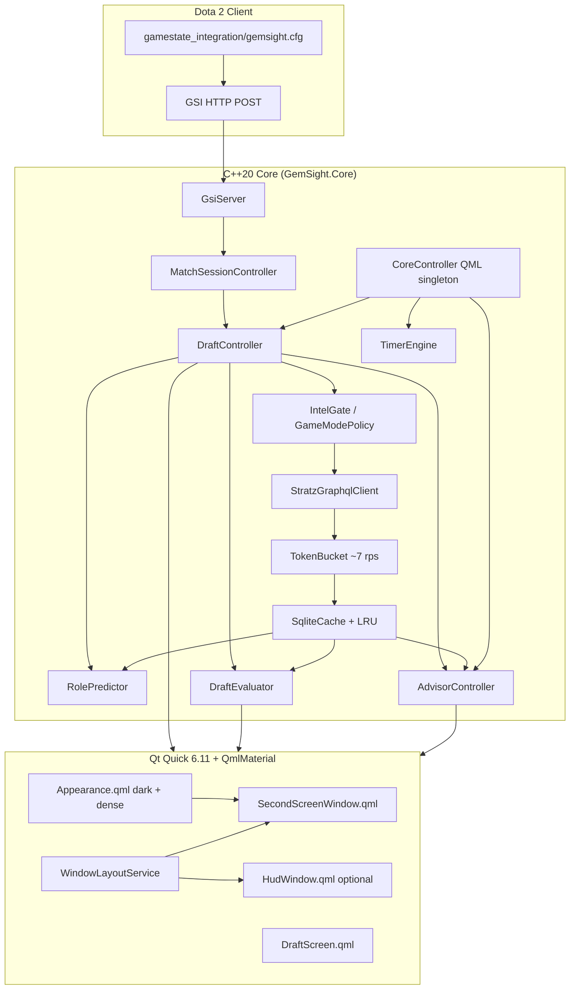

# GemSight — Dota 2 Companion Architecture (Phase 1 & 2)

Principal blueprint for a native **Qt 6.11+ / QmlMaterial / C++20** desktop companion that outperforms Dota Coach on draft ergonomics, latency, and information density (STRATZ ROSH–style).

**Execution choice:** C++20 core only (GSI, SQLite, STRATZ GraphQL). **No PySide.**

**UI lineage:** Mirror proven patterns from [Arachnel](https://github.com/BadKiko/Arachnel) (same author stack): thin QML boundary, `CoreController` façade, `qml/theme/Appearance.qml` token wiring, pinned QmlMaterial FetchContent, `QtConcurrent` / dedicated `QThreadPool` for I/O.

**Platform priority:** **Windows-first** for prototype and MVP. **Display:** second-screen window or lightweight **borderless HUD** — no intrusive in-game overlays, no click-through, no compositor-specific hooks.

---

## 1. Platform & build (Qt 6.11+, Arachnel-aligned)

| Concern | Policy |
|--------|--------|
| **Qt** | `qt_standard_project_setup(REQUIRES 6.11)`; modules: `Core`, `Gui`, `Network`, `Qml`, `Quick`, `HttpServer` (or `QHttpServer`), `Sql`, `Concurrent` |
| **C++** | `CMAKE_CXX_STANDARD 20`, `CMAKE_CXX_STANDARD_REQUIRED ON` |
| **QmlMaterial** | `FetchContent` with **pinned GIT_TAG** (do not float `main` — Arachnel pins after Layouts split broke packaging). Git LFS pull for icon fonts before build. Optional Windows patch cmake for MinGW/static quirks. |
| **QML layout** | `qml/Main.qml` → `qml/app/SecondScreenWindow.qml` (+ optional `HudWindow.qml`); `qml/theme/` (`Appearance.qml`, density tokens); `qml/components/` reusable cards; `qml/draft/` feature screens |
| **Import paths** | `engine.addImportPath(appDir + "/qml")`, material path via `QT_QML_MATERIAL_IMPORT_PATH` or baked deploy dir (same as Arachnel `configureQmlEngine`) |
| **Controls** | Prefer **QmlMaterial** (`import Qcm.Material as MD`); avoid `QtQuick.Controls` in app chrome except where Arachnel uses templates (`QtQuick.Templates` / `MD.ApplicationWindow`) |
| **High-DPI** | Rely on Qt 6 automatic scaling; set `QGuiApplication::setHighDpiScaleFactorRoundingPolicy(PassThrough)` before `QGuiApplication` construction; drive density via `MD.Token.window_class.select_type(width)` + debounced width handler (Arachnel `AppWindow` pattern); hero/portrait assets as multi-DPI PNG/WebP in `:/icons/` |
| **Deprecation hygiene** | No Qt5 APIs; network via `QNetworkAccessManager` + `QHttpServer`; JSON via `QJsonDocument`; properties via `Q_PROPERTY` / `QML_ELEMENT` |

### Threading model (hard rule)

All of the following run **off the GUI thread** (never block `QQuickWindow` render loop):

| Workload | Mechanism |
|----------|-----------|
| GSI HTTP accept + JSON parse | Dedicated worker `QObject` on `QThread`, or `QHttpServer` handler posting to `QThreadPool` |
| STRATZ GraphQL HTTP + JSON parse | `QtConcurrent::run` / `QThreadPool::globalInstance()` with `QFutureWatcher` → `QMetaObject::invokeMethod(..., Qt::QueuedConnection)` back to `DraftController` |
| SQLite read/write | Same pool; single-writer mutex on cache DB |
| UI updates | Coalesce on GUI thread at 50 ms during draft (`QTimer` debounce) |

Arachnel reference: `catalog_feed_loader.cpp`, `core_wiring_services.cpp` (`QThreadPool` + `QFutureWatcher`).

### Platform strategy & display architecture

#### OS targeting

| Layer | Windows (MVP) | Linux (later) |
|-------|----------------|---------------|
| **Priority** | Primary dev, daily dogfood, installer/signing | Port after MVP; no feature fork |
| **Core (`src/core/**`)** | C++20 + Qt 6.11 modules only | Same sources; `#ifdef` only in `src/platform/` shims if unavoidable |
| **Forbidden in core** | Win32/X11/Wayland APIs, DWM hooks, global hotkey drivers | — |
| **Build** | MSVC or MinGW kit; primary CI matrix leg | Add AppImage/flatpak leg when core tests green |
| **Paths & GSI cfg** | `%Steam%` / install helper copies cfg to Dota `gamestate_integration` | `~/.steam/...` equivalent via `QStandardPaths` + user setting |
| **Packaging** | Signed `.exe` + optional MSIX (M8) | Deferred |

**Future-proofing rule:** domain logic (GSI, STRATZ, SQLite, draft FSM, timers) lives in **platform-agnostic** TUs. Windows-only code is limited to packaging, optional custom title bar (Arachnel-style), and installer glue under `src/platform/win/`.

#### Display modes (no intrusive overlay)

GemSight is a **normal Qt top-level window** (or a second top-level HUD). It does **not** inject into the Dota swap chain, hook the graphics API, or use OS-specific transparent click-through layers.

| Mode | Purpose | Window profile | MVP |
|------|---------|----------------|-----|
| **Second screen (primary)** | Full draft board + advisor on auxiliary monitor | Standard `MD.ApplicationWindow`, resizable, taskbar entry | **Default** |
| **Borderless HUD (compact)** | Slim timer + lane tip strip beside main monitor | `Qt.FramelessWindowHint \| Qt.WindowStaysOnTopHint`; **opaque** `MD.Card` surface; **full hit-testing** (draggable, clickable) | Optional M6 |
| **In-game intrusive overlay** | Draw on top of Dota with pass-through clicks | DWM layered windows, X11 `_NET_WM_STATE`, Wayland constraints | **Out of scope** until post-MVP |

**Explicit non-goals (Phase 1–2):** click-through (`WS_EX_TRANSPARENT`, `Qt::WindowTransparentForInput`), per-pixel alpha stacks that behave differently on DWM vs Wayland, global low-level input hooks, and Overwolf-style in-game web overlays.

**Compositor note:** staying off the game framebuffer avoids Windows DWM vs Linux Wayland/X11 divergence; a borderless HUD is still a regular `QQuickWindow` moved with `QWindow::setPosition`, saved per display via `QScreen` + settings.



`WindowLayoutService` (core, Qt-only): remember screen name, geometry, and mode (`SecondScreen` \| `BorderlessHud`); restore on launch. No platform compositor APIs.

---

## 2. Phase 1 — Dota Coach decomposition (summary)

### Data mechanisms

| Source | Role |
|--------|------|
| **GSI** (`-gamestateintegration`, `gamestate_integration_*.cfg`) | Local `draft` picks/bans, `map.match_state`, `player.steamid`, clock, items — high frequency, **local client only** |
| **Optional GEP-equivalent signals** | If integrated later: roster JSON, party — not required for MVP if GSI + log hints suffice |
| **STRATZ GraphQL** | Profiles, hero pools, recent builds, bracket meta |
| **Local files** | Supplementary: console log tail for match id hints |

### Feature matrix (keep / cut / improve)

| Area | Dota Coach | GemSight |
|------|------------|----------|
| Draft intel | Overlay lists | **Second-screen** 5-column board + advisor column |
| Voice coaching | Core | **Cut MVP** (visual-first) |
| Ads / Overwolf | Yes | **Native Qt, no ads** |
| Timers | Yes | Keep, clock-synced from GSI |
| Smurf heuristics | Opaque | Explainable score |
| Pre-draft enemy IDs | Inconsistent UX | **Mode-aware** (see §3) |
| Role / lane in draft | Absent or guessed | **`RolePredictor`** (STRATZ + pick order) |
| Live draft WR | Rare | **`DraftEvaluator.liveWinProbability`** |
| Pick suggestions | Raw counters | **Mastery-weighted `AdvisorController`** |

### UX pitfalls to avoid

Overwolf + Chromium overhead, ad slots in draft, voice interrupting comms, single cluttered overlay, hero-gated free tier, ignoring Valve draft-phase rules in **ranked** (see compliance below).

---

## 3. Game mode awareness & pre-draft scouting (critical)

Valve anonymization is **not uniform across modes**. The draft controller must branch on **detected game mode** and **identity availability**, not a single global “wait until Strategy Time” gate.

### Mode classification

Detect from GSI `map` / lobby metadata (and optional `match_info.game_mode` if wired):

| Class | Typical modes | Opponent Steam IDs during hero select / ban phase |
|-------|----------------|---------------------------------------------------|
| **`ScoutEarly`** | Turbo, Normal All Pick (unranked), most customs | **Available immediately** on draft screen — batch STRATZ for enemies as soon as slot→account mapping exists |
| **`ScoutRanked`** | Ranked All Pick, RD ranked | Opponent **steamId/name often empty until** `DOTA_GAMERULES_STATE_STRATEGY_TIME` **or** per-player `pickConfirmed` / locked pick (GEP roster semantics) |
| **`ScoutCaptains`** | CM / CD | Ban order driven; IDs follow same ranked rules; hero picks partial until captains complete |

Implementation: `GameModePolicy` enum computed once per match from first authoritative payload, refinable when `game_mode` string arrives.

### Intelligence gating policy

```text
ScoutEarly:
  - On DRAFT_ENTERED: resolve enemy account IDs → enqueue StratzBatch(enemies)
  - Re-fetch on each new enemy ID or hero pick (debounced)
  - Teammates: parallel batch (always allowed)

ScoutRanked:
  - On DRAFT_ENTERED: StratzBatch(teammates only) + hero-meta for visible picks (no enemy account IDs)
  - On STRATEGY_TIME or enemy pickConfirmed/ID unlock: StratzBatch(enemies)
  - UI: enemy columns show hero + meta until profile row unlocks (no fake names)

ScoutCaptains:
  - Same as ScoutRanked for IDs; draft UI emphasizes ban order + captain picks
```

### Compliance note

Overwolf’s ranked guideline targets **target-ban via match history before picks complete**. **Turbo/unranked** early scouting is consistent with Valve not anonymizing those lobbies. Ranked path stays conservative: teammates early, enemies when IDs unlock.

### Identity resolution pipeline



`RosterAggregator` merges:

- GSI `draft.team#:pick#_id` (heroes, no Steam)
- GSI / supplemental roster steam IDs when present
- Slot index ↔ team_slot mapping (Immortal Draft: prefer `team_slot` over raw index)

---

## 4. Draft controller state machine

Top-level `MatchSessionController` owns phase; nested `DraftController` owns intel gating.

### Match phases

```text
Idle
  → QueueAccepted        (optional: 10 players accepted)
  → DraftActive          (HERO_SELECTION)
  → StrategyTime         (STRATEGY_TIME)
  → PreGame
  → InGame
  → PostGame
  → Idle
```

### Draft sub-states (`DraftController`)

| State | Entry | Actions |
|-------|--------|---------|
| `DraftIdle` | Not in draft | Clear models |
| `DraftOpening` | `HERO_SELECTION` | Read `GameModePolicy`; bind GSI draft slots |
| `DraftScoutAllies` | Always | Queue teammate STRATZ batch |
| `DraftScoutEnemiesEarly` | `policy == ScoutEarly` && enemy ID known | Queue enemy STRATZ batch (incl. **ban phase**) |
| `DraftScoutEnemiesRanked` | `policy == ScoutRanked` | Show placeholder cards; wait for unlock |
| `DraftEnemyUnlocked` | Strategy time **or** ID/pickConfirmed | Flush pending enemy IDs → STRATZ batch |
| `DraftRefreshing` | Pick/ban delta | Debounced partial refresh (new heroes only) |
| `DraftComplete` | `STRATEGY_TIME` or `PRE_GAME` | Final refresh, freeze cards for in-game advisor |



`IntelGate::mayFetchEnemyProfile(steamId)` implements policy + per-slot unlock flags.

On every transition into **`DraftRefreshing`**, the draft pipeline runs three analytical passes (worker thread), then publishes a single coalesced UI update:

1. **`RolePredictor`** — infer Pos 1–5 per locked hero.
2. **`DraftEvaluator`** — synergy/advantage rollup + lookahead threats + `liveWinProbability`.
3. **`AdvisorController`** — mastery-weighted personal pick recommendations (see §5.3).

---

## 5. Draft intelligence engines (v2.3)

Neither GSI nor raw pick events expose reliable **lane/position** labels during hero select. GemSight derives draft intelligence from **STRATZ matrices + pick-order priors + local player profile**, all off the UI thread.



| Module | Path | QML surface |
|--------|------|-------------|
| Role & position inference | `src/core/draft/role_predictor.{h,cpp}` | Enemy/ally `PlayerCard` position badges |
| Live draft evaluation & lookahead | `src/core/draft/draft_evaluator.{h,cpp}` | `liveWinProbability`, `DraftBalanceBar`, `LookaheadThreatCard` |
| Personal pick advisor | `src/core/advisor/advisor_controller.{h,cpp}` | Ranked hero chips + risk warnings |

### 5.1 Dynamic Role & Position Inference (`RolePredictor`)

**Problem:** GSI `draft` and roster events provide hero IDs and slots, not Pos 1–5 or lane assignments.

**Inputs (per team, recomputed on each pick delta):**

| Input | Source |
|-------|--------|
| Locked heroes + pick index (1–5 per team) | GSI `draft` / `DraftController` slot map |
| Per-hero role histogram (Pos 1–5, core vs support) | STRATZ `heroStats` / player `heroes` by `position` (bracket-filtered) |
| Per-player role affinity | STRATZ enemy/ally profile when `IntelGate` allows |
| Pick-order stage prior | Heuristic table below |

**Pick-order stage priors (team-relative pick number among revealed picks):**

| Stage | Picks on team (ordinal) | Prior emphasis |
|-------|-------------------------|----------------|
| **Stage 1** | 1–2 | Pos **4 / 5** (supports) |
| **Stage 2** | 3–4 | Pos **3** (offlane), **2** mid/flex |
| **Stage 3** | 5 (last pick) | Pos **1** carry, **2** hard mid |

**Scoring (per hero → position):**

```text
score(hero h, position p) =
    w_hist  * P_stratz(h, p | bracket)
  + w_order * P_stage(pickIndex, p)
  + w_player * P_player(steamId, p)   // 0 if ID gated
```

Default weights: `w_hist=0.45`, `w_order=0.35`, `w_player=0.20` (tunable in settings).

**Assignment:** Build a **5×5 cost matrix** `cost[h_slot][p] = -score(hero, p)` for locked heroes on a team. Solve with **greedy assignment** (sort heroes by pick order, assign each to best remaining position) or **Hungarian / bipartite matching** when all five heroes are locked (exact one-to-one Pos 1–5). Emit `RoleAssignment { teamSlot, heroId, position, confidence }` where `confidence ∈ [0,1]` is normalized margin vs runner-up.

**API (C++):**

- `RolePredictor::update(const DraftSnapshot& snap, const StratzRoleTables& tables)`
- `QVector<RoleAssignment> assignments(TeamSide side) const`
- Signal: `assignmentsChanged(TeamSide)`

**Integration:** `DraftController` owns `RolePredictor`; after STRATZ batch refresh, re-run inference; bind to `EnemyTeamModel` / ally model `positionRole` + `positionConfidence`.

### 5.2 Predictive Draft Intelligence & Lookahead (`DraftEvaluator`)

**Live win probability**

After each pick/ban delta, aggregate **all locked heroes** on Radiant vs Dire:

| Term | STRATZ source | Aggregation |
|------|---------------|-------------|
| **Synergy** (ally–ally) | Hero pair synergy matrix for bracket | Sum/mean over all ally pairs per team |
| **Advantage** (counter) | Hero vs hero matchup WR delta | Sum directed edges: our hero vs each revealed enemy |

```text
teamScore(T) = α * synergy(T) + β * counterEdges(T, opponent)
liveWinProbability = sigmoid(score(Radiant) - score(Dire))  // map to [0.0, 1.0]
```

Default `α=0.35`, `β=0.65`. Expose to QML:

- `DraftEvaluator::liveWinProbability` (`double`, `NOTIFY liveWinProbabilityChanged`)
- Optional `radiantEdge` / `direEdge` for `DraftBalanceBar` gradient (0.5 = even).

Recompute on worker thread; debounce with draft UI (50 ms).

**Lookahead enemy threat scanner**

1. **Infer missing enemy roles** via `RolePredictor` on *hypothetical* completion: which Pos 1–5 slots on enemy team have no hero yet.
2. **Candidate pool:** top meta heroes for each missing role from STRATZ bracket `heroStats` (pick rate × WR).
3. **Counter-threat rank:** for each candidate `h`, score  
   `threat(h) = Σ counterAdvantage(h, ourRevealedHero_i)` across our locked roster.
4. **ScoutEarly boost:** when enemy `steamId` known for the slot likely to fill a missing role, multiply candidates by `signatureWeight(steamId, h)` from that player’s top heroes (`player.heroes`).
5. Emit **top 3** `LookaheadThreat { heroId, role, threatScore, reason }` for `LookaheadThreatCard.qml`.

**API (C++):**

- `DraftEvaluator::evaluate(const DraftSnapshot&, const RolePredictor&, const StratzMatrices&)`
- `Q_PROPERTY(double liveWinProbability ...)`
- `QAbstractListModel* lookaheadThreats()`

### 5.3 Personal Pick Advisor — Mastery-Weighted Counter-Pick (`AdvisorController`)

> **Normative specification (v2.3).** Implementations **must** follow this section for pick ranking, tier labels, and anti-trap behavior. UI strings are defined here and in `translations/gemsight_*.ts` (`advisor.*` context).

**Ownership:** `src/core/advisor/advisor_controller.{h,cpp}` + `src/models/pick_recommendation_model.{h,cpp}`  
**QML:** `qml/advisor/AdvisorPanel.qml`, `qml/advisor/PickRecommendationChip.qml`  
**Façade:** `CoreController::advisor()` → `AdvisorController*` (sibling to `DraftController`, not nested inside it).

#### 5.3.1 Core problem

Existing tools (including Dota Coach–class counter lists) **blindly recommend** heroes with the highest statistical matchup advantage (e.g. **+10% winrate delta** vs revealed enemies), even when the local player has **0 games** on that hero. That produces “paper counters” and thrown matches.

**GemSight rule:** rank candidates by a **composite** of bracket matchup edge **and** personal comfort (signature / mastery), then surface **explicit risk chips** when meta and mastery disagree.

**Worked contrast (same draft, same enemies):**

| Hero | Matchup Δ (vs revealed) | Games (lifetime) | Legacy tool rank | GemSight tier |
|------|-------------------------|------------------|------------------|---------------|
| Phoenix | +3% | 1000 | #2 (below OD) | **Rank 1 — Recommended** (signature + positive Δ) |
| Phoenix | −1.5% | 1000 | hidden | **Rank 2 — Viable** (signature mitigates mild minus) |
| Outworld Destroyer | +10% | 0 | **#1** | **Warning — Meta only** (never default #1) |
| Phoenix | −8% | 1000 | — | **Warning — High risk** (signature but hard countered) |

#### 5.3.2 Algorithm & scoring

**Candidate set `C`:** all heroes legal for the local player’s **intended position** (from `RolePredictor` on allies + `SettingsStore.preferredPositions`), minus already picked/banned. Pool size capped (~40) by bracket pick rate for performance.

**Matchup advantage** (cumulative vs **already revealed enemy heroes** only):

```text
MatchupAdvantage(h) = Σ_{e ∈ enemyRevealed} counterDelta(h, e)

counterDelta(h, e) = WR_bracket(h vs e) − 0.5    // STRATZ matchup matrix; clamp to [-0.15, +0.15] per edge
```

**Personal mastery** (local player STRATZ profile — same `steamAccountId` as GSI `player.steamid`):

```text
PersonalMastery(h) = clamp01(
    0.50 * gamesNorm(games_total, h)
  + 0.30 * gamesNorm(games_30d, h)
  + 0.20 * winrateNorm(winrate_player, h)
)

gamesNorm(g, h) = min(1, g / G_cap)     // default G_cap = 300
winrateNorm(w, h) = clamp((w − 0.45) / 0.20, 0, 1)   // 45% → 0, 65% → 1
```

**Composite score (sort key, higher = better pick):**

```text
Score(h) = (MatchupAdvantage(h) * W_matchup) + (PersonalMastery(h) * W_mastery)
```

| Constant | Default | `SettingsStore` key |
|----------|---------|-------------------|
| `W_matchup` | `0.55` | `advisor/weightMatchup` |
| `W_mastery` | `0.45` | `advisor/weightMastery` |
| `G_cap` | `300` | `advisor/masteryGameCap` |
| High mastery threshold | `PersonalMastery ≥ 0.65` | `advisor/signatureMasteryThreshold` |
| Mild negative matchup | `MatchupAdvantage ≥ −0.015` | `advisor/viableMatchupFloor` |
| Strong negative matchup | `MatchupAdvantage ≤ −0.08` | `advisor/highRiskMatchupCeiling` |
| Unplayed hero | `games_total < 1` | `advisor/minGamesPlayed` |
| “High” paper counter | `MatchupAdvantage ≥ +0.06` | `advisor/metaOnlyAdvantageFloor` |

#### 5.3.3 Signature hero (local player)

A hero `h` is a **signature** for the local player when **any** of:

- `games_total(h) ≥ 100` **and** `games_total(h) / player.matchCount ≥ 0.08` (8% of career), or  
- `h` is in the top **3** by `games_total` on `player.heroes` for the active bracket, or  
- `PersonalMastery(h) ≥ signatureMasteryThreshold` (default 0.65).

Signature status drives **Rank 1/2** eligibility and **High risk** warnings; it is **independent** of enemy signature pools (enemy top heroes stay on `PlayerIntelModel` / draft cards).

#### 5.3.4 Recommendation hierarchy & UI chips

After scoring, assign **`PickTier`** (enum) **before** final sort; then sort by `Score` descending within tier groups.

| `PickTier` | Logic (all required conditions) | Default RU message | i18n id |
|------------|----------------------------------|--------------------|---------|
| `Recommended` | `isSignature(h)` **and** `MatchupAdvantage(h) ≥ 0` | Рекомендуется: комфортный сигнатурный пик с плюсом в драфте | `advisor.recommendedSignature` |
| `Viable` | `isSignature(h)` **and** `MatchupAdvantage(h) ≥ viableMatchupFloor` (e.g. −1.5%) | Играбельно: лёгкий минус в матчапе, но сильный опыт на герое | `advisor.viableSignature` |
| `WarningMetaOnly` | `games_total(h) < minGamesPlayed` **and** `MatchupAdvantage(h) ≥ metaOnlyAdvantageFloor` | Мета-контрпик: осторожно — герой не отыгран | `advisor.warningMetaOnly` |
| `WarningHighRisk` | `isSignature(h)` **and** `MatchupAdvantage(h) ≤ highRiskMatchupCeiling` | Высокий риск: сильные контрпики врага на сигнатуру | `advisor.warningHighRisk` |
| `Neutral` | else | Показать `Score`; без акцентного чипа | `advisor.neutral` |

**Chip UI:** `PickRecommendationChip.qml` maps tier → `MD.AssistChip` color (primary / secondary / error / warning). Show **matchup %** and **games** as secondary line (`+3% · 1240 игр`).

#### 5.3.5 Anti-trap & sort order (mandatory)

1. **Primary sort:** tier precedence `Recommended > Viable > Neutral > WarningHighRisk > WarningMetaOnly` (warnings visible but never auto-first).  
2. **Secondary sort:** `Score(h)` descending.  
3. **Anti-trap:** If `games_total(h) < minGamesPlayed`, `h` **cannot** outrank any `Recommended` or `Viable` candidate unless `SettingsStore.advisorAggressiveMeta == true`.  
4. **Cap list:** expose top **8** picks to QML (`take: 8`).

#### 5.3.6 `AdvisorController` — C++ contract

```cpp
// src/core/advisor/advisor_controller.h (normative surface)
class AdvisorController : public QObject {
    Q_OBJECT
    Q_PROPERTY(PickRecommendationModel* pickRecommendations READ pickRecommendations CONSTANT)
    Q_PROPERTY(double weightMatchup READ weightMatchup WRITE setWeightMatchup NOTIFY weightsChanged)
    Q_PROPERTY(double weightMastery READ weightMastery WRITE setWeightMastery NOTIFY weightsChanged)
    Q_PROPERTY(bool advisorAggressiveMeta READ advisorAggressiveMeta WRITE setAdvisorAggressiveMeta NOTIFY weightsChanged)

public:
    // Called from DraftController on worker thread; emits recommendationsReady() on GUI thread
    Q_INVOKABLE void evaluate(const DraftSnapshot& snap,
                              const StratzMatrices& matrices,
                              const PlayerHeroStats& localPlayer,
                              int intendedPosition);

    PickRecommendationModel* pickRecommendations();

signals:
    void recommendationsReady();
    void weightsChanged();
};
```

`PickRecommendationModel` roles: `heroId`, `heroName`, `score`, `tier` (`int` / enum), `message`, `matchupAdvantage`, `personalMastery`, `gamesTotal`, `games30d`, `isSignature`.

**Lifecycle:**

```text
DraftRefreshing → (worker) AdvisorController::evaluate(...)
               → build sorted list + tiers
               → QMetaObject::invokeMethod → pickRecommendations()->reset(rows)
               → QML AdvisorPanel ListView updates
```

**STRATZ inputs (local player, cached per patch):**

```graphql
query LocalPlayerMastery($id: Long!, $heroTake: Int! = 40) {
  player(steamAccountId: $id) {
    matchCount
    heroes(request: { take: $heroTake }) {
      heroId
      matchCount
      winCount
    }
    # extend with recent-window stats when schema exposes gamesLast30d / similar
  }
}
```

#### 5.3.7 Implementation milestones (do not drop from roadmap)

| Milestone | AdvisorController deliverable |
|-----------|-------------------------------|
| **M2** | Class stub + `PickRecommendationModel`; demo rows on `simulateTurboDraft()` illustrating all five tiers (Phoenix / OD examples) |
| **M3** | Real `LocalPlayerMastery` + matchup matrix; live `evaluate()` on each pick delta |
| **M4** | Lane/item adjunct JSON; settings UI for weights and `advisorAggressiveMeta` |

---


## 6. End-to-end system architecture



### `CoreController` façade (Arachnel pattern)

Single QML singleton `GemSight.Core` exposing:

- `DraftController* draft` — owns `RolePredictor` + `DraftEvaluator` sub-objects (or injects shared instances)
- `AdvisorController* advisor` — mastery-weighted pick list + lane/item adjunct (M4+)
- `TimerController* timers`
- `SettingsStore* settings` — `advisor/weightMatchup`, `advisor/weightMastery`, `advisorAggressiveMeta` (see §5.3.2)
- `AdvisorController* advisor` — **normative pick logic §5.3**; `pickRecommendations` model for QML

Heavy logic stays in `src/core/**`; façade only forwards signals and registered models (`QAbstractListModel` for enemy columns, threats, recommendations).

---

## 7. QML architecture (file tree)

```text
gemsight/
├── CMakeLists.txt              # Qt 6.11, FetchContent qml_material (pinned)
├── cmake/
│   └── patch-qml-material.cmake
├── src/
│   ├── app/main.cpp
│   ├── core/
│   │   ├── facade/core_controller.{h,cpp}
│   │   ├── gsi/gsi_server.{h,cpp}
│   │   ├── session/match_session_controller.{h,cpp}
│   │   ├── draft/draft_controller.{h,cpp}
│   │   ├── draft/role_predictor.{h,cpp}
│   │   ├── draft/draft_evaluator.{h,cpp}
│   │   ├── draft/intel_gate.{h,cpp}
│   │   ├── draft/game_mode_policy.{h,cpp}
│   │   ├── advisor/advisor_controller.{h,cpp}
│   │   ├── stratz/stratz_client.{h,cpp}
│   │   ├── cache/sqlite_cache.{h,cpp}
│   │   └── timers/timer_engine.{h,cpp}
│   └── models/
│       ├── enemy_team_model.{h,cpp}
│       ├── player_intel_model.{h,cpp}
│       └── pick_recommendation_model.{h,cpp}   # AdvisorController list
├── resources/
│   └── gsi/gamestate_integration_gemsight.cfg
└── qml/
    ├── Main.qml
    ├── app/SecondScreenWindow.qml   # primary MD.ApplicationWindow
    ├── app/HudWindow.qml            # optional compact borderless HUD (M6)
    ├── theme/Appearance.qml
    ├── theme/DraftDensity.qml
    ├── draft/DraftScreen.qml
    ├── draft/DraftBalanceBar.qml   # liveWinProbability gradient
    ├── draft/LookaheadThreatCard.qml
    ├── draft/EnemyColumn.qml
    ├── draft/PlayerCard.qml      # MD.Card + position badge
    ├── draft/WinrateBar.qml      # MD.LinearIndicator
    ├── advisor/MatchupPanel.qml  # pick chips + warnings
    ├── advisor/PickRecommendationChip.qml
    └── components/AppSnackbar.qml
```

### QmlMaterial usage

| UI | Component |
|----|-----------|
| Shell | `MD.ApplicationWindow`, `MD.MProp.*` colors |
| Player tile | `MD.Card`, `MD.ListItem`, `MD.Badge` |
| Ban chips | `MD.AssistChip` |
| WR | `WinrateBar` → `MD.LinearIndicator` |
| Draft balance | `DraftBalanceBar` — `liveWinProbability` centered at 0.5 |
| Lookahead threats | `LookaheadThreatCard` — top-3 enemy draft threats |
| Pick advisor | `PickRecommendationChip` — tier color + `MD.AssistChip` |
| Toggle compact HUD | `MD.FloatingActionButton` → show/hide `HudWindow` |
| Theme | `Appearance.qml` sets `MD.Token.themeMode = MD.Enum.Dark`, monochrome palette for ROSH-like density |

`SecondScreenWindow`: place `DraftBalanceBar` under draft header; stack `LookaheadThreatCard` above advisor column.

---

## 8. STRATZ GraphQL batching

**Endpoint:** `POST https://api.stratz.com/graphql`  
**Headers:** `Authorization: Bearer <token>`, `User-Agent: STRATZ_API`

Jobs built on worker thread; results marshaled to `PlayerIntelModel` on GUI thread.

```graphql
query DraftEnemyBatchFive(
  $e0: Long!, $e1: Long!, $e2: Long!, $e3: Long!, $e4: Long!
  $heroTake: Int! = 10
  $matchTake: Int! = 3
) {
  constants { heroes { id displayName } }
  e0: player(steamAccountId: $e0) { ...EnemyDraftPlayer }
  e1: player(steamAccountId: $e1) { ...EnemyDraftPlayer }
  e2: player(steamAccountId: $e2) { ...EnemyDraftPlayer }
  e3: player(steamAccountId: $e3) { ...EnemyDraftPlayer }
  e4: player(steamAccountId: $e4) { ...EnemyDraftPlayer }
}
```

Validate fragments against [GraphiQL](https://api.stratz.com/graphiql/). Rate limit: ≥150 ms between requests when batching multiple HTTP calls.

**Turbo/unranked:** fire this query during ban phase as enemy IDs appear.  
**Ranked:** same query only after `IntelGate` allows each enemy `steamAccountId`.

---

## 9. MVP roadmap (M0–M9)

### M0 — Scaffold (Arachnel parity, Windows-first)

- [ ] CMake: Qt **6.11+**, C++20, pinned QmlMaterial + LFS fonts script
- [ ] `main.cpp`: `configureQmlEngine`, `HighDpiScaleFactorRoundingPolicy::PassThrough`, load `Main` module
- [ ] `Appearance.qml` dark Material 3 tokens; **`SecondScreenWindow.qml`** empty shell at 60 FPS
- [ ] `CoreController` singleton registered; no business logic yet
- [ ] **Primary CI / dev loop on Windows** (MSVC); Linux configure-only or secondary job (no Linux-only APIs in `src/core`)
- [ ] `src/platform/` stub with empty `win/` and `unix/` targets for future shims only

**Exit:** On **Windows**, application window opens on chosen monitor; QmlMaterial icons render; zero deprecation warnings at `/W4` or `-Wall`.

### M1 — GSI + session phase machine

- [ ] Ship `gamestate_integration_gemsight.cfg` (`draft`, `map`, `player`, `hero`, `provider`)
- [ ] `GsiServer` on worker thread; parse JSON off UI thread
- [ ] `MatchSessionController`: `Idle → DraftActive → StrategyTime → InGame`
- [ ] `GameModePolicy` from first `game_mode` / lobby type payload
- [ ] Log phase transitions (structured logging)

**Exit:** Entering Turbo/unranked draft logs `ScoutEarly`; ranked logs `ScoutRanked`.

### M2 — Draft UI + mode-aware intel gate + inference stubs

- [ ] `DraftScreen`: 5× `EnemyColumn` + ally strip; bound to GSI draft hero IDs
- [ ] `IntelGate` + `DraftController` state machine (§4)
- [ ] **ScoutEarly:** trigger `StratzBatchJob` on ban phase when enemy IDs present (stub client OK)
- [ ] **ScoutRanked:** teammate batch live; enemy cards show meta-only until unlock signal
- [ ] **`RolePredictor` stub:** pick-order priors only; position badges on cards (low confidence until M3)
- [ ] **`DraftEvaluator` stub:** `liveWinProbability` from pick count / demo formula; empty `LookaheadThreatCard` placeholder
- [ ] **`DraftBalanceBar.qml`** bound to `DraftEvaluator.liveWinProbability`
- [ ] Debounced model updates on GUI thread

**Exit:** Turbo lobby shows enemy column “loading → profile” during bans; ranked shows teammate intel early and enemy profiles only after strategy/pick lock; balance bar moves on demo draft.

### M3 — STRATZ + SQLite + role tables

- [ ] Token in settings; real batch query; cache by `(steamId, patch)`
- [ ] Preload bracket **hero role histograms**, **pair synergy**, **vs matchup** matrices into SQLite
- [ ] **`RolePredictor` v1:** STRATZ hist + pick-order priors + greedy/bipartite assignment; confidence on UI badges

**Exit:** Position labels on draft cards match plausible roles for revealed picks.

### M4 — Advisor + evaluator production

- [ ] **`DraftEvaluator` v1:** synergy + advantage rollup; real `liveWinProbability`; **lookahead top-3** threats with ScoutEarly signature weighting
- [ ] **`LookaheadThreatCard.qml`** populated from `lookaheadThreats` model
- [ ] **`AdvisorController`:** mastery-weighted counter-pick (`Score = W_m * Matchup + W_mast * Mastery`); chip tiers + warnings (§5.3)
- [ ] **`PickRecommendationChip.qml`** in advisor column
- [ ] JSON starter builds + lane modifier rules (in-game advisor adjunct)

**Exit:** Personal pick list never promotes 0-game “paper counters” above signature comfort picks; balance bar and threat card update each pick in demo/real draft.

### M5 — Timers

- `TimerEngine` + timer strip in `SecondScreenWindow` (and optional sync to HUD).

### M6 — Borderless HUD (optional compact window)

- [ ] `HudWindow.qml`: small opaque borderless window (`FramelessWindowHint` + `WindowStaysOnTopHint`); timer + one advisor line
- [ ] `WindowLayoutService`: save/restore screen + geometry for both windows
- [ ] **No** click-through, **no** transparency hacks, **no** game injection

**Exit:** User can run full draft on monitor 2 and a draggable HUD on monitor 1 without compositor-specific code.

### M7 — Party graph + ban suggestions

### M8 — Beta installer (Windows)

- Signed Windows installer; document GSI cfg copy step; Linux packaging backlog item.

### M9 — Linux desktop port (post-MVP)

- Enable full CI build + AppImage; verify Wayland/X11 window placement only (same Qt window flags).

---

## 10. Display modes reference

| Mode | QML entry | Flags | Input | Cross-platform |
|------|-----------|-------|-------|----------------|
| **Second screen** | `SecondScreenWindow.qml` | Default `Qt.Window` | Full | Yes (Qt) |
| **Borderless HUD** | `HudWindow.qml` | `FramelessWindowHint`, `WindowStaysOnTopHint` | Full (drag handle) | Yes (Qt); test multi-monitor on Windows first |
| **Intrusive overlay** | — | — | — | **Not planned Phase 1–2** |

---

## 11. Positioning vs Dota Coach

| Dimension | Dota Coach | GemSight |
|-----------|------------|----------|
| Runtime | Overwolf + web | Qt 6.11 native |
| Threading | Mixed | **Strict worker I/O** |
| Ranked draft | Often blurry compliance | **Explicit IntelGate** |
| Turbo / NA | Same as ranked UX | **Early enemy STRATZ in ban phase** |
| Stack | — | **Arachnel-proven QML/Material layout** |
| Display | In-game Overwolf overlay | **Second screen + optional borderless HUD** |
| OS | Windows-centric Overwolf | **Windows-first MVP; portable C++20 core** |

---

*Document version: 2.3 — normative `AdvisorController` spec (§5.3): mastery-weighted counter-pick, signature definition, tier chips, anti-trap sort, C++ API, STRATZ mastery query, M2–M4 advisor milestones.*
