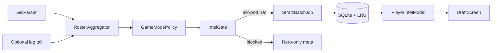
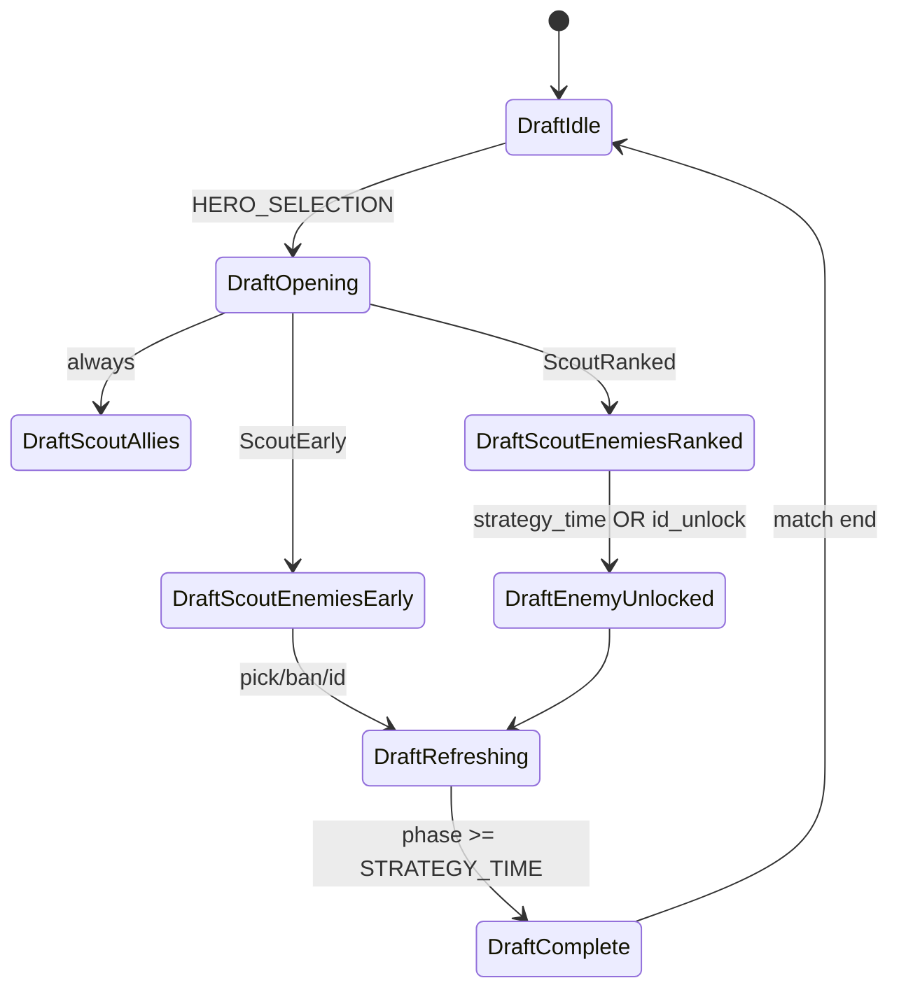
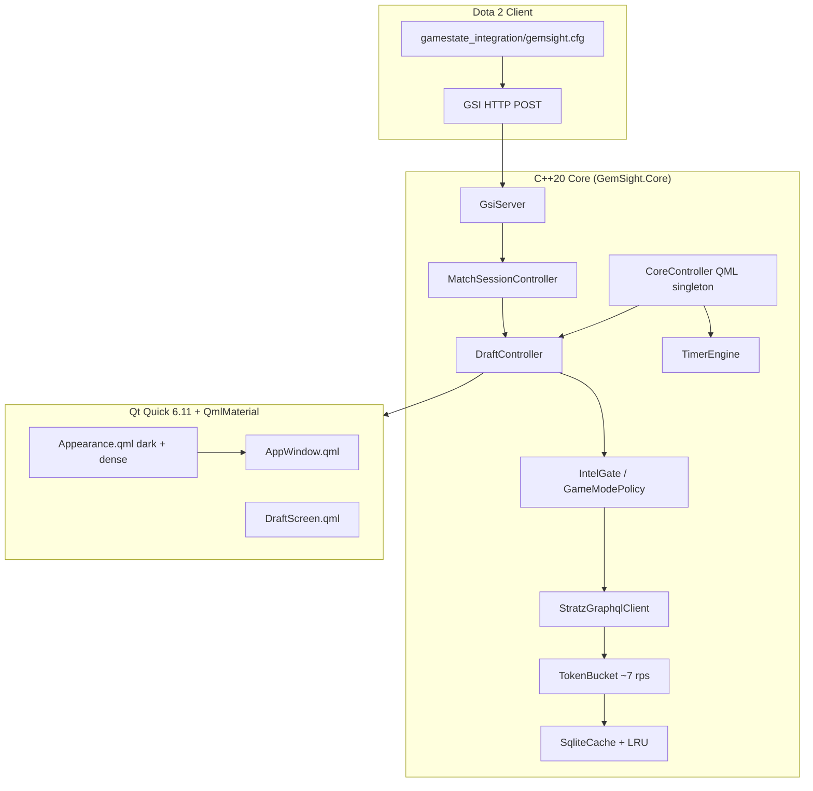

# GemSight — Dota 2 Companion Architecture (Phase 1 & 2)

Principal blueprint for a native **Qt 6.11+ / QmlMaterial / C++20** desktop companion that outperforms Dota Coach on draft ergonomics, latency, and information density (STRATZ ROSH–style).

**Execution choice:** C++20 core only (GSI, SQLite, STRATZ GraphQL). **No PySide.**

**UI lineage:** Mirror proven patterns from [Arachnel](https://github.com/BadKiko/Arachnel) (same author stack): thin QML boundary, `CoreController` façade, `qml/theme/Appearance.qml` token wiring, pinned QmlMaterial FetchContent, `QtConcurrent` / dedicated `QThreadPool` for I/O.

---

## 1. Platform & build (Qt 6.11+, Arachnel-aligned)

| Concern | Policy |
|--------|--------|
| **Qt** | `qt_standard_project_setup(REQUIRES 6.11)`; modules: `Core`, `Gui`, `Network`, `Qml`, `Quick`, `HttpServer` (or `QHttpServer`), `Sql`, `Concurrent` |
| **C++** | `CMAKE_CXX_STANDARD 20`, `CMAKE_CXX_STANDARD_REQUIRED ON` |
| **QmlMaterial** | `FetchContent` with **pinned GIT_TAG** (do not float `main` — Arachnel pins after Layouts split broke packaging). Git LFS pull for icon fonts before build. Optional Windows patch cmake for MinGW/static quirks. |
| **QML layout** | `qml/Main.qml` → `qml/app/AppWindow.qml`; `qml/theme/` (`Appearance.qml`, density tokens); `qml/components/` reusable cards; `qml/draft/` feature screens |
| **Import paths** | `engine.addImportPath(appDir + "/qml")`, material path via `QT_QML_MATERIAL_IMPORT_PATH` or baked deploy dir (same as Arachnel `configureQmlEngine`) |
| **Controls** | Prefer **QmlMaterial** (`import Qcm.Material as MD`); avoid `QtQuick.Controls` in app chrome except where Arachnel uses templates (`QtQuick.Templates` / `MD.ApplicationWindow`) |
| **High-DPI** | Rely on Qt 6 automatic scaling; set `QGuiApplication::setHighDpiScaleFactorRoundingPolicy(PassThrough)` before `QGuiApplication` construction; drive density via `MD.Token.window_class.select_type(width)` + debounced width handler (Arachnel `AppWindow` pattern); hero/portrait assets as multi-DPI PNG/WebP in `:/icons/` |
| **Deprecation hygiene** | No Qt5 APIs; network via `QNetworkAccessManager` + `QHttpServer`; JSON via `QJsonDocument`; properties via `Q_PROPERTY` / `QML_ELEMENT` |

### Threading model (hard rule)

All of the following run **off the GUI thread** (never block `QQuickWindow` render loop):

| Workload | Mechanism |
|----------|-----------|
| GSI HTTP accept + JSON parse | Dedicated worker `QObject` on `QThread`, or `QHttpServer` handler posting to `QThreadPool` |
| STRATZ GraphQL HTTP + JSON parse | `QtConcurrent::run` / `QThreadPool::globalInstance()` with `QFutureWatcher` → `QMetaObject::invokeMethod(..., Qt::QueuedConnection)` back to `DraftController` |
| SQLite read/write | Same pool; single-writer mutex on cache DB |
| UI updates | Coalesce on GUI thread at 50 ms during draft (`QTimer` debounce) |

Arachnel reference: `catalog_feed_loader.cpp`, `core_wiring_services.cpp` (`QThreadPool` + `QFutureWatcher`).

---

## 2. Phase 1 — Dota Coach decomposition (summary)

### Data mechanisms

| Source | Role |
|--------|------|
| **GSI** (`-gamestateintegration`, `gamestate_integration_*.cfg`) | Local `draft` picks/bans, `map.match_state`, `player.steamid`, clock, items — high frequency, **local client only** |
| **Optional GEP-equivalent signals** | If integrated later: roster JSON, party — not required for MVP if GSI + log hints suffice |
| **STRATZ GraphQL** | Profiles, hero pools, recent builds, bracket meta |
| **Local files** | Supplementary: console log tail for match id hints |

### Feature matrix (keep / cut / improve)

| Area | Dota Coach | GemSight |
|------|------------|----------|
| Draft intel | Overlay lists | **5-column enemy board** + advisor column |
| Voice coaching | Core | **Cut MVP** (visual-first) |
| Ads / Overwolf | Yes | **Native Qt, no ads** |
| Timers | Yes | Keep, clock-synced from GSI |
| Smurf heuristics | Opaque | Explainable score |
| Pre-draft enemy IDs | Inconsistent UX | **Mode-aware** (see §3) |

### UX pitfalls to avoid

Overwolf + Chromium overhead, ad slots in draft, voice interrupting comms, single cluttered overlay, hero-gated free tier, ignoring Valve draft-phase rules in **ranked** (see compliance below).

---

## 3. Game mode awareness & pre-draft scouting (critical)

Valve anonymization is **not uniform across modes**. The draft controller must branch on **detected game mode** and **identity availability**, not a single global “wait until Strategy Time” gate.

### Mode classification

Detect from GSI `map` / lobby metadata (and optional `match_info.game_mode` if wired):

| Class | Typical modes | Opponent Steam IDs during hero select / ban phase |
|-------|----------------|---------------------------------------------------|
| **`ScoutEarly`** | Turbo, Normal All Pick (unranked), most customs | **Available immediately** on draft screen — batch STRATZ for enemies as soon as slot→account mapping exists |
| **`ScoutRanked`** | Ranked All Pick, RD ranked | Opponent **steamId/name often empty until** `DOTA_GAMERULES_STATE_STRATEGY_TIME` **or** per-player `pickConfirmed` / locked pick (GEP roster semantics) |
| **`ScoutCaptains`** | CM / CD | Ban order driven; IDs follow same ranked rules; hero picks partial until captains complete |

Implementation: `GameModePolicy` enum computed once per match from first authoritative payload, refinable when `game_mode` string arrives.

### Intelligence gating policy

```text
ScoutEarly:
  - On DRAFT_ENTERED: resolve enemy account IDs → enqueue StratzBatch(enemies)
  - Re-fetch on each new enemy ID or hero pick (debounced)
  - Teammates: parallel batch (always allowed)

ScoutRanked:
  - On DRAFT_ENTERED: StratzBatch(teammates only) + hero-meta for visible picks (no enemy account IDs)
  - On STRATEGY_TIME or enemy pickConfirmed/ID unlock: StratzBatch(enemies)
  - UI: enemy columns show hero + meta until profile row unlocks (no fake names)

ScoutCaptains:
  - Same as ScoutRanked for IDs; draft UI emphasizes ban order + captain picks
```

### Compliance note

Overwolf’s ranked guideline targets **target-ban via match history before picks complete**. **Turbo/unranked** early scouting is consistent with Valve not anonymizing those lobbies. Ranked path stays conservative: teammates early, enemies when IDs unlock.

### Identity resolution pipeline



`RosterAggregator` merges:

- GSI `draft.team#:pick#_id` (heroes, no Steam)
- GSI / supplemental roster steam IDs when present
- Slot index ↔ team_slot mapping (Immortal Draft: prefer `team_slot` over raw index)

---

## 4. Draft controller state machine

Top-level `MatchSessionController` owns phase; nested `DraftController` owns intel gating.

### Match phases

```text
Idle
  → QueueAccepted        (optional: 10 players accepted)
  → DraftActive          (HERO_SELECTION)
  → StrategyTime         (STRATEGY_TIME)
  → PreGame
  → InGame
  → PostGame
  → Idle
```

### Draft sub-states (`DraftController`)

| State | Entry | Actions |
|-------|--------|---------|
| `DraftIdle` | Not in draft | Clear models |
| `DraftOpening` | `HERO_SELECTION` | Read `GameModePolicy`; bind GSI draft slots |
| `DraftScoutAllies` | Always | Queue teammate STRATZ batch |
| `DraftScoutEnemiesEarly` | `policy == ScoutEarly` && enemy ID known | Queue enemy STRATZ batch (incl. **ban phase**) |
| `DraftScoutEnemiesRanked` | `policy == ScoutRanked` | Show placeholder cards; wait for unlock |
| `DraftEnemyUnlocked` | Strategy time **or** ID/pickConfirmed | Flush pending enemy IDs → STRATZ batch |
| `DraftRefreshing` | Pick/ban delta | Debounced partial refresh (new heroes only) |
| `DraftComplete` | `STRATEGY_TIME` or `PRE_GAME` | Final refresh, freeze cards for in-game advisor |



`IntelGate::mayFetchEnemyProfile(steamId)` implements policy + per-slot unlock flags.

---

## 5. End-to-end system architecture



### `CoreController` façade (Arachnel pattern)

Single QML singleton `GemSight.Core` exposing:

- `DraftController* draft`
- `AdvisorController* advisor`
- `TimerController* timers`
- `SettingsStore* settings`

Heavy logic stays in `src/core/**`; façade only forwards signals and registered models (`QAbstractListModel` for enemy columns).

---

## 6. QML architecture (file tree)

```text
gemsight/
├── CMakeLists.txt              # Qt 6.11, FetchContent qml_material (pinned)
├── cmake/
│   └── patch-qml-material.cmake
├── src/
│   ├── app/main.cpp
│   ├── core/
│   │   ├── facade/core_controller.{h,cpp}
│   │   ├── gsi/gsi_server.{h,cpp}
│   │   ├── session/match_session_controller.{h,cpp}
│   │   ├── draft/draft_controller.{h,cpp}
│   │   ├── draft/intel_gate.{h,cpp}
│   │   ├── draft/game_mode_policy.{h,cpp}
│   │   ├── stratz/stratz_client.{h,cpp}
│   │   ├── cache/sqlite_cache.{h,cpp}
│   │   └── timers/timer_engine.{h,cpp}
│   └── models/
│       ├── enemy_team_model.{h,cpp}
│       └── player_intel_model.{h,cpp}
├── resources/
│   └── gsi/gamestate_integration_gemsight.cfg
└── qml/
    ├── Main.qml
    ├── app/AppWindow.qml
    ├── theme/Appearance.qml
    ├── theme/DraftDensity.qml
    ├── draft/DraftScreen.qml
    ├── draft/EnemyColumn.qml
    ├── draft/PlayerCard.qml      # MD.Card
    ├── draft/WinrateBar.qml      # MD.LinearProgressIndicator
    ├── advisor/MatchupPanel.qml
    └── components/AppSnackbar.qml
```

### QmlMaterial usage

| UI | Component |
|----|-----------|
| Shell | `MD.ApplicationWindow`, `MD.MProp.*` colors |
| Player tile | `MD.Card`, `MD.ListItem`, `MD.Badge` |
| Ban chips | `MD.AssistChip` |
| WR | `WinrateBar` → `MD.LinearProgressIndicator` |
| FAB overlay pin | `MD.FloatingActionButton` |
| Theme | `Appearance.qml` sets `MD.Token.themeMode = MD.Enum.Dark`, monochrome palette for ROSH-like density |

---

## 7. STRATZ GraphQL batching

**Endpoint:** `POST https://api.stratz.com/graphql`  
**Headers:** `Authorization: Bearer <token>`, `User-Agent: STRATZ_API`

Jobs built on worker thread; results marshaled to `PlayerIntelModel` on GUI thread.

```graphql
query DraftEnemyBatchFive(
  $e0: Long!, $e1: Long!, $e2: Long!, $e3: Long!, $e4: Long!
  $heroTake: Int! = 10
  $matchTake: Int! = 3
) {
  constants { heroes { id displayName } }
  e0: player(steamAccountId: $e0) { ...EnemyDraftPlayer }
  e1: player(steamAccountId: $e1) { ...EnemyDraftPlayer }
  e2: player(steamAccountId: $e2) { ...EnemyDraftPlayer }
  e3: player(steamAccountId: $e3) { ...EnemyDraftPlayer }
  e4: player(steamAccountId: $e4) { ...EnemyDraftPlayer }
}
```

Validate fragments against [GraphiQL](https://api.stratz.com/graphiql/). Rate limit: ≥150 ms between requests when batching multiple HTTP calls.

**Turbo/unranked:** fire this query during ban phase as enemy IDs appear.  
**Ranked:** same query only after `IntelGate` allows each enemy `steamAccountId`.

---

## 8. MVP roadmap (M0–M8) — revised M0–M2

### M0 — Scaffold (Arachnel parity)

- [ ] CMake: Qt **6.11+**, C++20, pinned QmlMaterial + LFS fonts script
- [ ] `main.cpp`: `configureQmlEngine`, `HighDpiScaleFactorRoundingPolicy::PassThrough`, load `Main` module
- [ ] `Appearance.qml` dark Material 3 tokens; `AppWindow.qml` empty shell at 60 FPS
- [ ] `CoreController` singleton registered; no business logic yet
- [ ] CI smoke: configure + compile (Linux; Windows when available)

**Exit:** Application window opens; QmlMaterial icons render; zero deprecation warnings at `/W4` or `-Wall`.

### M1 — GSI + session phase machine

- [ ] Ship `gamestate_integration_gemsight.cfg` (`draft`, `map`, `player`, `hero`, `provider`)
- [ ] `GsiServer` on worker thread; parse JSON off UI thread
- [ ] `MatchSessionController`: `Idle → DraftActive → StrategyTime → InGame`
- [ ] `GameModePolicy` from first `game_mode` / lobby type payload
- [ ] Log phase transitions (structured logging)

**Exit:** Entering Turbo/unranked draft logs `ScoutEarly`; ranked logs `ScoutRanked`.

### M2 — Draft UI + mode-aware intel gate

- [ ] `DraftScreen`: 5× `EnemyColumn` + ally strip; bound to GSI draft hero IDs
- [ ] `IntelGate` + `DraftController` state machine (§4)
- [ ] **ScoutEarly:** trigger `StratzBatchJob` on ban phase when enemy IDs present (stub client OK)
- [ ] **ScoutRanked:** teammate batch live; enemy cards show meta-only until unlock signal
- [ ] Debounced model updates on GUI thread

**Exit:** Turbo lobby shows enemy column “loading → profile” during bans; ranked shows teammate intel early and enemy profiles only after strategy/pick lock.

### M3 — STRATZ + SQLite

- Token in settings; real batch query; cache by `(steamId, patch)`.

### M4 — Advisor v1

- JSON starter builds + lane modifier rules.

### M5 — Timers

- `TimerEngine` + dock UI.

### M6 — Overlay / second screen

- Frameless `OverlayRoot.qml`.

### M7 — Party graph + ban suggestions

### M8 — Beta installer

---

## 9. Overlay vs second screen

| Mode | Flags |
|------|--------|
| Second screen | Normal `MD.ApplicationWindow` |
| Overlay | `Qt.FramelessWindowHint \| Qt.WindowStaysOnTopHint \| Qt.Tool`; opaque `MD.Card` on transparent root |

---

## 10. Positioning vs Dota Coach

| Dimension | Dota Coach | GemSight |
|-----------|------------|----------|
| Runtime | Overwolf + web | Qt 6.11 native |
| Threading | Mixed | **Strict worker I/O** |
| Ranked draft | Often blurry compliance | **Explicit IntelGate** |
| Turbo / NA | Same as ranked UX | **Early enemy STRATZ in ban phase** |
| Stack | — | **Arachnel-proven QML/Material layout** |

---

*Document version: 2.0 — incorporates Qt 6.11+, C++20-only core, Arachnel UI patterns, and game-mode-aware scouting.*
